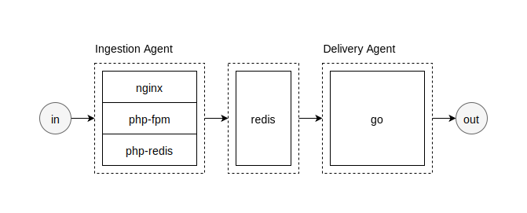

# Development

## Server Configuration (45 minutes)

After reading the project spec, it looks like I just need PHP, Redis, and Go on the server. I'll install everything on the box now and consider making separate containers later.

### Ingestion Agent

I chose `nginx` because I prefer it and I assume it's being used in production at Kochava. The rest are just standard install commands.

```
$ apt-get install nginx
$ apt-get install php-fpm
$ apt-get install redis-server
$ apt-get install php-redis
```

Next I need to configure `/etc/nginx/sites-available/default`. `INGEST_IP` is the address of the box provided to me. I uncommented the lines needed for `php-fpm` to handle PHP files.

```nginx
server_name [INGEST_IP];

location ~ \.php$ {
	include snippets/fastcgi-php.conf;
	fastcgi_pass unix:/run/php/php7.0-fpm.sock;
}
```

I also need to configure `/etc/redis/redis.conf`. I changed the default port to `INGEST_PORT` and added authentication with `INDEX_PASS` (which is a very long hash).

```conf
port [INGEST_PORT]
requirepass [INGEST_PASS]
```

Now that I've configured `nginx`, `php-fpm`, and `redis`, I can restart each service and enable them on boot. 

```
$ systemctl restart nginx
$ systemctl enable nginx
```

```
$ systemctl restart php7.0-fpm
$ systemctl enable php7.0-fpm
```

```
$ systemctl restart redis-server.service
$ systemctl enable redis-server.service
```

## Development

I find that I'm most effective when I have a clear mental model of the application architecture. So, I created a diagram based on the project spec to assist me in keeping things organized.

<p align="center">
	
</p>

I'll worry about turning each component into it's own container later. For now I'll just write the code. I'll start with the Ingestion Agent. 

### Ingestion Agent (1 hour)

The Ingestion Agent needs to accept JSON requests and push them to Redis for the Delivery Agent to process. This is the JSON request format from the spec:

```json
{
	"endpoint": {
		"method": "POST",
		"url": "http://sample.com/data?title={mascot}&image={location}&foo={bar}"
	},
	"data": [
		{
			"mascot": "Gopher",
			"location":"https://blog.golang.org/gopher/gopher.png"
		}
	]
}
```

I'm thinking this will just be a small PHP script. The interesting part in the spec is where it says:

> Push a "postback" object to Redis for each "data" object contained in accepted request.

This makes sense, because an endpoint object might have multiple data objects associated with it. It would be wasteful to push the endpoint object with each data object.

So for each accepted HTTP request to the Ingestion Agent, one `endpoint` object will be pushed to Redis, and one or more `data` objects will be associated with that `endpoint` and pushed to Redis.

These are the Redis commands I'm considering:

1. `SET postback:[UUID] [JSON_OBJECT]`
	* This will contain the `endpoint` JSON object (with a `count` field).
2. `RPUSH postbacks postback:[UUID]`
	* The Delivery Agent will listen on this list.
3. And for each `data` object run `RPUSH postback:[UUID]:data [JSON_OBJECT]`

This seems to be working well for now. I will consider making it more "modular" later. It's small and it works, so now I'll move on to the Delivery Agent.

### Delivery Agent (4 hours)

I found that Go's concurrency model really fit this use case, and I made extensive use of them. When the Delivery Agent receives a new postback object from Redis, a new goroutine is created to listen for data objects associated with that endpoint. And every time a data object is pushed to Redis, a new goroutine is started to make the necessary HTTP request.

It's a simple service, and with more time I'm sure I could add more analytics and optimizations.

### Testing Tool (2 hours)

I created a small testing tool to produce requests for the Ingestion Agent and also consume requests from the Delivery Agent. This way I could see if anything was getting dropped, and could estimate performance.

## Availability (15 minutes)

I just used a systemd service file for the Delivery Agent, as the rest of the components are already systemd services. It would be cool to Dockerize everything but I didn't have time.

To enable on boot I just ran:

```
$ systemctl enable delivery.service
```

And for viewing logs I use:

```
$ journalctl -f -u delivery.service
```

Which outputs something like:

```
2018/01/19 23:52:42 received: http://165.227.194.19:8080/?req_id=9&data_id=0
                        delivery time:         2018-01-19 23:52:42.266251193 +0000 UTC
                        response code:         200 OK
                        response time:         2018-01-19 23:52:42.34192451 +0000 UTC
                        response body:         ''
```


